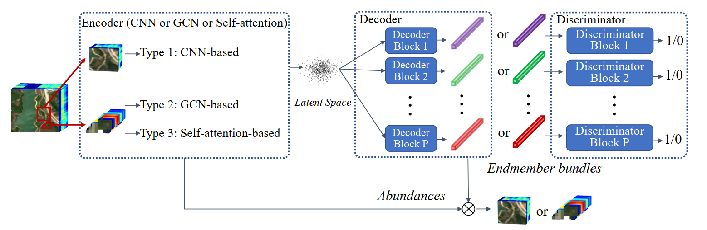
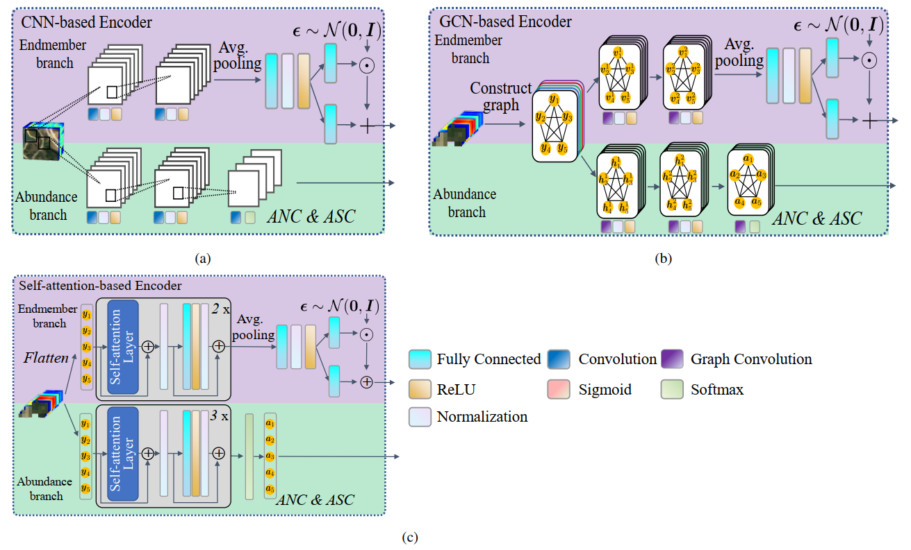

# Deep Generative Model for Spatial-spectral Unmixing with Multiple Endmember Priors (DGMSSU)

The code in this toolbox implements the "[Deep Generative Model for Spatial-spectral Unmixing with Multiple Endmember Priors](https://ieeexplore.ieee.org/document/9759362)". More specifically, it is detailed as follow.




## Train

Run `python train.py` to train the DGMSSU.


## Citation

**Please kindly cite the papers if this code is useful and helpful for your research.**

```
@ARTICLE{shi2022Deep,  
author={Shi, Shuaikai and Zhang, Lijun and Altmann, Yoann and Chen, Jie},  
journal={IEEE Transactions on Geoscience and Remote Sensing},   
title={Deep Generative Model for Spatial-spectral Unmixing with Multiple Endmember Priors},   
year={2022},  
volume={},  
number={},  
pages={1-1},  
doi={10.1109/TGRS.2022.3168712}}
```

## Licensing

Copyright (C) 2022 Shuaikai Shi

This program is free software: you can redistribute it and/or modify it under the terms of the GNU General Public License as published by the Free Software Foundation, version 3 of the License.

This program is distributed in the hope that it will be useful, but WITHOUT ANY WARRANTY; without even the implied warranty of MERCHANTABILITY or FITNESS FOR A PARTICULAR PURPOSE. See the GNU General Public License for more details.

You should have received a copy of the GNU General Public License along with this program.

## 
